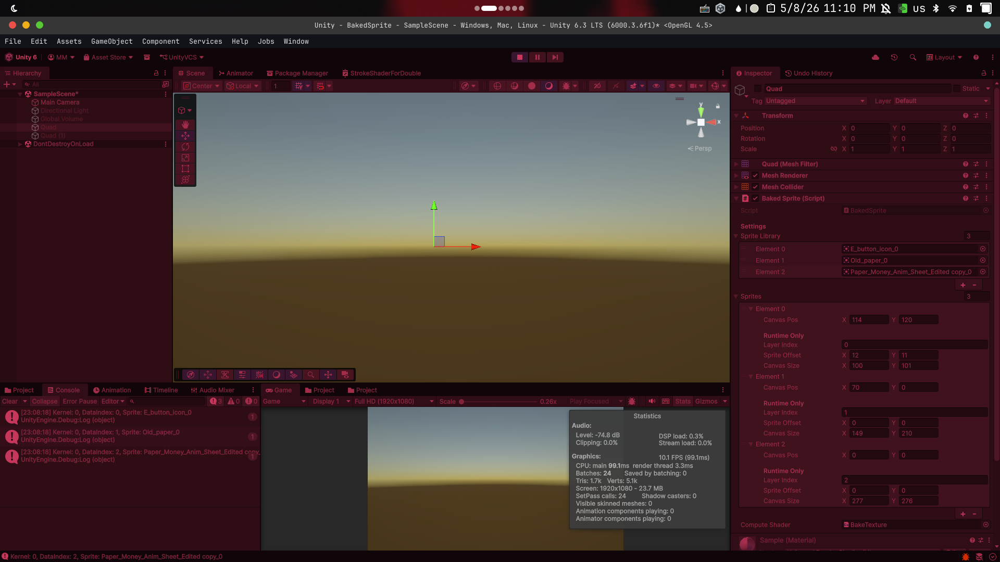
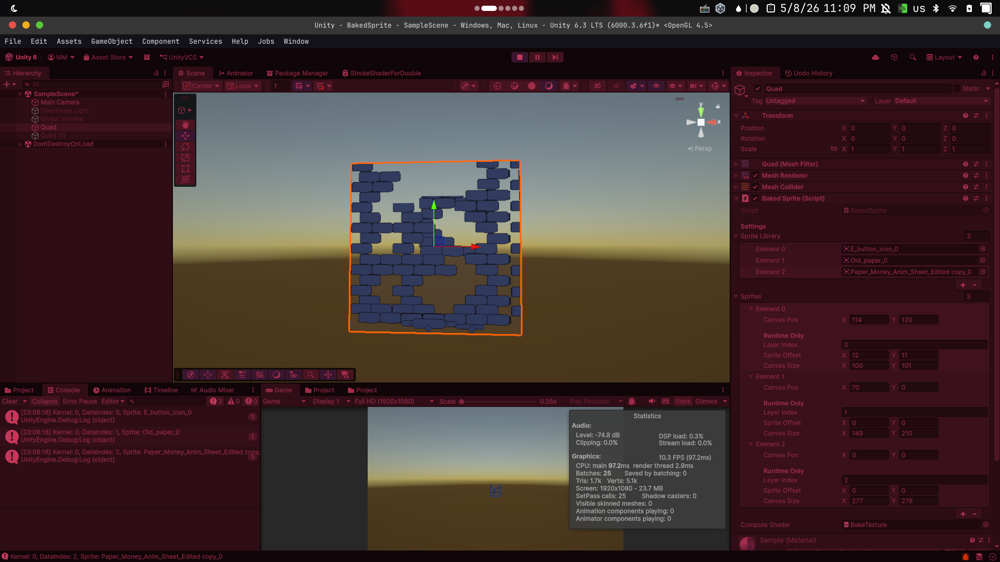
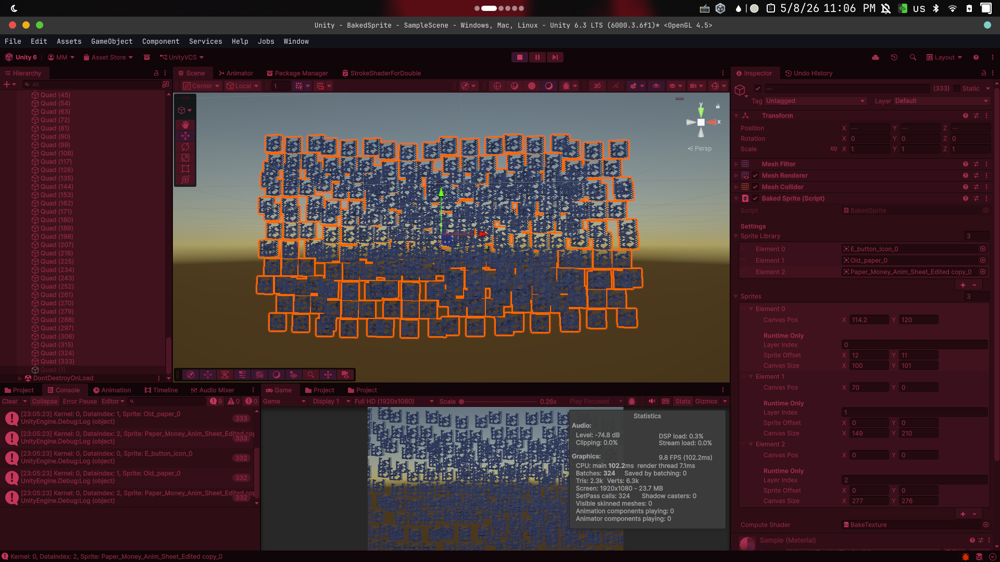

# SpriteBaker
GPU-Accelerated Sprite Baker for Unity
- [Installation](#installation)
- [Features](#features)
- [Performance](#performance)
- [Tech Stack](#tech-stack)
- [Images](#images)

___
## Installation
1. Open your terminal or command prompt.
2. Navigate to your Unity project's Assets/Plugins folder:

    ```bash
    # Replace the path with your own project path
    cd ./MyProject/Assets/Plugins
    ```
3. Clone the repository:

    ```bash
    git clone https://github.com/ARTTonyTone/SpriteBaker.git
    ```
And you're done! SpriteBaker will now appear in your project. You can attach it to any GameObject as a component.

---
## Features :
- GPU-side sprite composition (No CPU overhead).
- Support for multiple sprites with custom positions and sizes.
- RenderTexture-based output for dynamic materials.

---
## Performance :
This plugin is designed to offload heavy texture operations from the CPU to the GPU, utilizing the parallel processing power of Compute Shaders.
<br></br>
### Why Compute Shaders?
Traditional texture baking in Unity often relies on Texture2D.SetPixels, which runs on a single CPU thread and causes significant performance bottlenecks (frame drops), especially with high-resolution textures.

- Parallel Processing: While the CPU processes pixels one by one, the GPU processes thousands of pixels simultaneously using thread groups (e.g., 8x8 threads per group).
- Zero CPU Overhead: The entire baking logic-positioning, scaling, and blending-happens directly on the Video RAM (VRAM).
- Asynchronous Workflow: By using ComputeShader.Dispatch, the bake operation doesn't block the main thread, keeping your game's frame rate stable.
- Instant Updates: Perfect for dynamic card games or UI elements where textures need to be updated in real-time based on game logic.
<br></br>
### Benchmarks (Typical Scenario)
|Feature | CPU (`SetPixels`) | GPU (Compute Shader)|
| --- | --- | --- |
|Complexity |*O(n)* (Linear) |*O(1)* (Parallelized)|
|Memory Transfer |High (CPU to RAM) |Low (Stay on VRAM)|
|Latency |Heavy (Millisecond range) |Ultra-Low (Microsecond range)|

---
## Tech Stack :
Unity, HLSL, Compute Shaders.

---
## Images

|Tests|
| :---: |
|0 object|
||
|1 boject|
||
|333 object|
||
